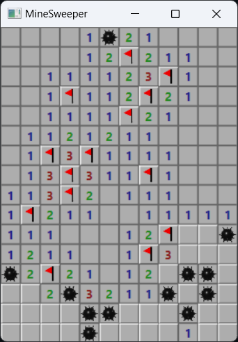

# minesweeper-d2d
Minesweeper with Rust and Windows Direct2D

# Current Issues
The ```mine.png``` and ```flag.png``` files need to be in the current path or available through the path environment.


# The Game

### 22-OCT-2022 Update
Mine image drawn on mined cells. Won game state added.

### 19-OCT-2022 Update
Right click for flagging or questioning potential mine sites has been added.



